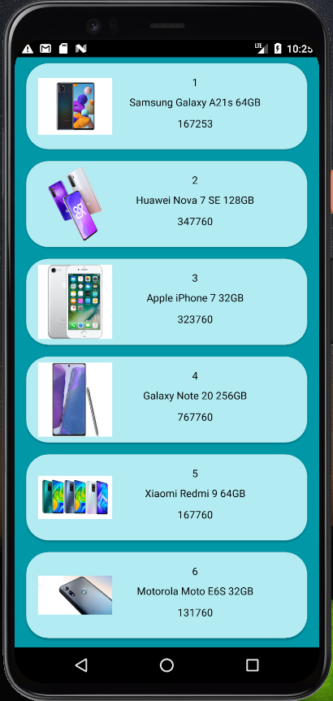

# Phone APP

Aplicacion que muestra datos basico de un celular, detalle del producto con posibilidad de mandar con un boton flotante un correo con el celular selecionado
con los dato de celular y id unico de cada producto.

##Consumo de Api

Consume dato de la Api

```bash
    Productos
    http://my-json-server.typicode.com/Himuravidal/FakeAPIdata/products/
    Detalle
    https://my-json-server.typicode.com/Himuravidal/FakeAPIdata/details
```

## Implementacion

- [Retrofit](https://square.github.io/retrofit/) - Consumo de API
- [Picasso](https://square.github.io/picasso/) - Importar imágenes
- [Lifecycle](https://developer.android.com/jetpack/androidx/releases/lifecycle) - Respuesta segun ciclo de vida de los componentes
- [Room](https://developer.android.com/jetpack/androidx/releases/room) - Acceso a base de datos

## Capturas de pantallas


![Pantalla Detalle]
![Patalla Detalle 2]
![Pantalla Correo]
